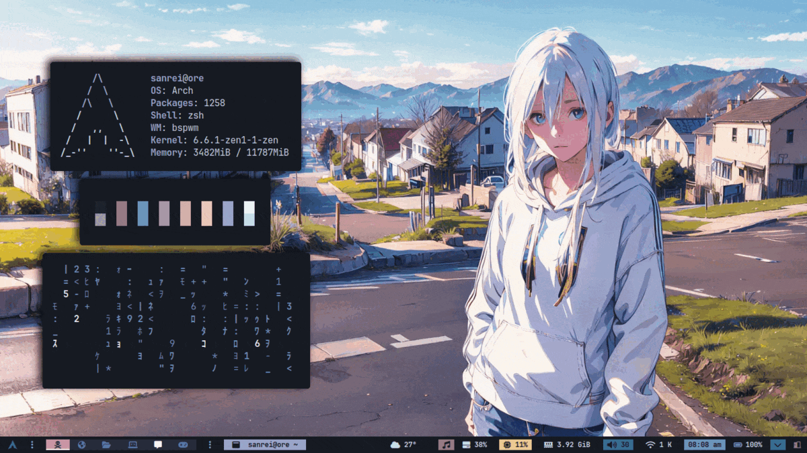

<!-- # 🍚 dotfiles v1 -->


## 🔍 Information

- OS: [Arch Linuwu](https://archlinux.org)
- Window Manager: [Bspwm](https://github.com/baskerville/bspwm)
- Terminal: [Alacritty](https://github.com/alacritty/alacritty) / [Kitty](https://sw.kovidgoyal.net/kitty/binary/)
- Shell: [Zsh](https://zsh.org)
- Launcher : [Rofi](https://github.com/davatorium/rofi)
- Bar: [Polybar](https://github.com/polybar/polybar)
- Visualizer: [Cava](https://github.com/karlstav/cava)

## 🗺 Overview



### 🛠 Other

- Theme Swither ([Rofi](https://github.com/davatorium/rofi), [Bspwm](https://github.com/baskerville/bspwm))
- Brightness / Volume OSD ([Rofi](https://github.com/davatorium/rofi))
- Lockscreen ([i3lock-color](https://github.com/Raymo111/i3lock-color))
- Powermenu ([Rofi](https://github.com/davatorium/rofi))
- Calendar Widget ([eww](https://github.com/elkowar/eww))
- Wallpaper Random/Selector ([Rofi](https://github.com/davatorium/rofi))
- Clipboard Selector ([Rofi](https://github.com/davatorium/rofi))
- Change Keyboard Layout ([Rofi](https://github.com/davatorium/rofi))
- File Manager ([thunar](https://docs.xfce.org/xfce/thunar/start))
- Color Picker ([xcolor](https://github.com/Soft/xcolor))
- TUI File Manager ([Yazi](https://github.com/sxyazi/yazi))
- Music ([Ncmpcpp](https://github.com/ncmpcpp/ncmpcpp))
- Restart Bspwm ([Rofi](https://github.com/davatorium/rofi))
- Reload sxhkd ([Rofi](https://github.com/davatorium/rofi))
- Kill Selector ([Rofi](https://github.com/davatorium/rofi))
- Terminal ([Alacritty](https://github.com/alacritty/alacritty) / [Kitty](https://sw.kovidgoyal.net/kitty/binary/))
- Change Terminal ([Rofi](https://github.com/davatorium/rofi))
- Scratchpad ([Bspwm](https://github.com/baskerville/bspwm))
- Theme Selector ([Rofi](https://github.com/davatorium/rofi))

## ⌨️ Keybinds

To shows Keybinds Use `F1` or rofi keybindings `Alt` + `F1`.

|             **Action**             |               **Keys**                |
|------------------------------------|---------------------------------------|
| Browser                            | `Super` + `z`                         |
| File Manager                       | `Super` + `e`                         |
| Color Picker                       | `Super` + `p`                         |
| Yazi                               | `Super` + `r`                         |
| Music                              | `Super` + `m`                         |
| Keybindings                        | `F1`                                  |
| Rofi Keybindings                   | `Alt` + `F1`                          |
| Restart BSPWM                      | `Super` + `Shift` + `r`               |
| Reload sxhkd daemon                | `Super` + `Shift` + `s`               |
| Kill Selector                      | `Super` + `Escape`                    |
| Hide {Unhide} Bar                  | `Super` + {`u`,  `y`}                 |
| Terminal                           | `Super` + `Enter`                     |
| Floating terminal                  | `Super` + `Alt` + `Enter`             |
| Change Terminal                    | `Super` + `Alt` + `t`                 |
| Scratchpad                         | `Super` + `k`                         |
| Menu Apps                          | `Super` + `d`                         |
| Theme Selector                     | `Super` + `v`                         |
| Window Selector                    | `Super` + `w`                         |
| Clipboard Selector                 | `Super` + `comma`                     |
| Change Keyboard Layout             | `Super` + `Alt` + `k`                 |
| Wallpaper {Random} Selector        | `Super` + {`Shift`} `Alt` + `w`       |
| Switch workspaces                  | `Super` + `Alt` + `Ctrl` + `← →`      |
| Switch Last workspaces             | `Super` + `Tab`                       |
| Switch {Old/Last} workspaces       | `Super` + {`o`,`i`}                   |
| Switch to specific workspace       | `Super` + `1-9`                       |
| Rotate workspace                   | `Alt` + `Space`                       |
| Send (& Follow) to other workspace | `Super` + `Alt` + {`Shift`} + `1-9`   |
| Send to other workspace & follow   | `Super` + `Alt` + `← →`               |
| Set Node {Pseudo} Tiled            | `Super` + {`Shift`} `t`               |
| Set Node Floating                  | `Super` + `s`                         |
| Set Node Fullscreen                | `Super` + `f`                         |
| Kill {All} App                     | `Super` + {`Shift`} + `q`             |
| Hide {Unhide} Node                 | `Super` + {`Shift`} + `h`             |
| Toggle Layout                      | `Super` + `n`                         |
| Swap Biggest Mode                  | `Super` + `g`                         |
| Jump Last                          | `Super` + `j`                         |
| Mark Node                          | `Super` + `Alt` + `m`                 |
| Lock Node                          | `Super` + `Alt` + `x`                 |
| Sticky Node                        | `Super` + `Alt` + `s`                 |
| Private Node                       | `Super` + `Alt` + `p`                 |
| Change Node focus                  | `Super` + `← ↑ ↓ →`                   |
| Swap Nodes                         | `Super` + `Shift` + `← ↑ ↓ →`         |
| Focus last Node/Workspace          | `Ctrl` + `Shift` + {`comma`,`period`} |
| Expand node                        | `Super` + `Ctrl` + `← ↑ ↓ →`          |
| Contract node                      | `Super` + `Ctrl` + `Shift` + `← ↑ ↓ →`|
| Move floating node                 | `Alt` + `Shift` + `← ↑ ↓ →`           |
| Preselect direction                | `Super` + `Ctrl` + {`h`,`v`}          |
| Preselect ratio                    | `Super` + `Shift` + `1-9`             |
| Cancel preselection                | `Super` + `Shift` + `Space`           |
| Change transparency                | `Ctrl` + `Alt` + {`+`,`-`,`t`}        |
| Toggle Transparency                | `Ctrl` + `Alt` + `t`                  |
| Toggle Picom                       | `Ctrl` + `Alt` + `p`                  |


## 📦 Setup

<details open>
<summary><b>Installation:</b></summary>

The installer only works for **ARCH** Linux, and based distros.

<b>Open a terminal in HOME</b>
First download the [installer](RiceInstaller)
```sh
curl https://raw.githubusercontent.com/adilhyz/dotfiles-v1/master/RiceInstaller -o $HOME/RiceInstaller
```
Now give it execute permissions
```sh
chmod +x RiceInstaller
```
Finally run the [installer](RiceInstaller)
```sh
./RiceInstaller
```
</details>

## References
- [gh0stzk](https://github.com/gh0stzk/dotfiles)
- [jordandalley](https://github.com/jordandalley/yt-dlp-scripts)
