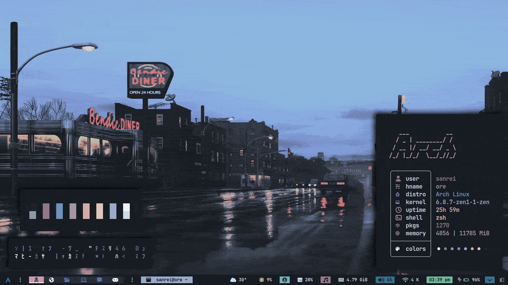

<!-- # 🍚 dotfiles v1 -->


## :thinking: Information

- OS: [Nyarch](https://archlinux.org)
- Window Manager: [Bspwm](https://github.com/baskerville/bspwm)
- Terminal: [Alacritty](https://github.com/alacritty/alacritty)
- Shell: [Zsh](https://zsh.org)
- Launcher : [Rofi](https://github.com/davatorium/rofi)
- Bar: [Polybar](https://github.com/polybar/polybar)
- Visualizer: [Cava](https://github.com/karlstav/cava)

## 🌏 Overview




## Information
* Theme Swither
* Brightness / Volume OSD
* Lockscreen (physlock)
* Powermenu
* Calendar Widget

## 📦 Setup

<details open>
<summary><b>Installation:</b></summary>

The installer only works for **ARCH** Linux, and based distros.

<b>Open a terminal in HOME</b>
First download the [installer](RiceInstaller)
```sh
curl https://raw.githubusercontent.com/adilhyz/dotfiles-v1/master/RiceInstaller -o $HOME/RiceInstaller
```
Now give it execute permissions
```sh
chmod +x RiceInstaller
```
Finally run the [installer](RiceInstaller)
```sh
./RiceInstaller
```
</details>

## References
- [gh0stzk](https://github.com/gh0stzk/dotfiles)
- [jordandalley](https://github.com/jordandalley/yt-dlp-scripts)